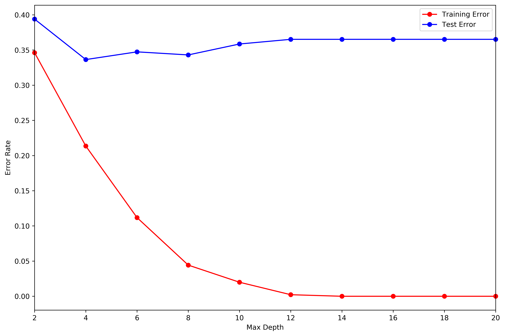

# Decision Tree

Lei Mao

University of Chicago

## Introduction

This implementation of decision tree classification algorithm from scratch builds decision tree for training data extremely fast.
It makes no assumptions for the training data as long as the data has features and target.
It splits categorical features to branches using each value of the feature, i.e., the categorical feature could have more than two values, and the split could have more than two branches.
The categorical feature will only be used once in the decision tree.
It splits numerical feature to two branches.
The numerical feature could be used multiple times in the decision tree.

## Dependencies

Python 3.5

Numpy 1.14

Pandas 0.22

## Files

```
.
├── arrhythmia.data
├── decision_tree.py
├── main.py
├── README.md
├── utils.py
└── demo.png
```

## Usage

To build decision tree:

```python
from decision_tree import DecisionTree

model = DecisionTree(tree_max_depth)
model.fit(data = train_set, features = features, target = target, feature_types = feature_types)

training_predictioins = model.predict(test = train_set)
test_predictions = model.predict(test = test_set)
```

## Demo

To build a decision tree on [Arrhythmia](http://archive.ics.uci.edu/ml/datasets/Arrhythmia) dataset:

```bash
$ python main.py
```

<p align="center">
    
</p>

It takes around 5 minutes to run on a single core of Intel Core i7-3770 CPU.

```
Tree Max Depth: 2
Training Error: 0.346233
Test Error: 0.393977
Tree Max Depth: 4
Training Error: 0.213503
Test Error: 0.336433
Tree Max Depth: 6
Training Error: 0.111788
Test Error: 0.347398
Tree Max Depth: 8
Training Error: 0.044283
Test Error: 0.343041
Tree Max Depth: 10
Training Error: 0.019941
Test Error: 0.358567
Tree Max Depth: 12
Training Error: 0.002215
Test Error: 0.365205
Tree Max Depth: 14
Training Error: 0.000000
Test Error: 0.365205
Tree Max Depth: 16
Training Error: 0.000000
Test Error: 0.365205
Tree Max Depth: 18
Training Error: 0.000000
Test Error: 0.365205
Tree Max Depth: 20
Training Error: 0.000000
Test Error: 0.365205
Time Elapsed: 00:05:26
```


## Reference:

* "Introduction to Data Mining" by Tan, Steinbach, and Kumar, page 162
* "Artificial Intelligence: A Modern Approach", Rusell-Norvig, page 702
